# Option 1: Traversal Unwrap - Fix Schema Traversal to Handle Effect Types

> **Status:** Chosen (Primary Fix)
>
> Implementation checklist: `todo/meta/option1-implementation-plan.md:1`

## Executive Summary

The current vulnerability exists because `sensitive()` marks fields using Zod's `.meta()` API, but schema traversal in `src/transform/traverse.ts` only handles a subset of Zod types (optional, nullable, lazy, object, array, union). When a schema is wrapped in effect types like `transform`, `refine`, `catch`, `default`, `brand`, or `pipe`, the metadata becomes inaccessible.

**Option 1** expands the traversal to unwrap these effect types and find the inner schema's metadata.

## Why This Choice (Product + DX Framing)

We want sensitivity to be an **annotation** that is consumed by the server-side read-time policy pass, not a new “schema primitive” that product developers have to reason about in normal Zod usage.

- Keeping sensitivity as `.meta()` preserves **normal Zod schemas** and output types (`z.infer` stays focused on the domain shape).
- This reduces the cognitive overhead for product developers who are used to “Zod-validated data” and don’t want sensitive schemas to become a separate conceptual type graph.
- It also keeps schema reuse (server/client) cleaner: client-side code can validate/consume the already-redacted envelope without reintroducing a custom sensitive ZodType into the schema structure.

Safety posture:
- We pair Option 1 with the Option 4 safety net (orphaned `SensitiveDb` detection defaulting to `throw`) so that any missed traversal case fails closed.

## Important Limitation (Be Explicit)

Option 1 fixes cases where metadata is **hidden behind wrapper/effect nodes** (e.g. `optional`, `nullable`, `pipe`, `default`, `catch`, etc.).

It does **not** help for Zod operations that **clone and drop metadata** without retaining an “inner schema” pointer (e.g. many `z.string()` convenience methods like `.email()`, `.min()`, and some uses of `.refine()` depending on Zod internals).

Practical guidance:
- Prefer applying `sensitive(...)` (or `.meta(...)`) at the **end** of the chain for string/number “check” methods.
- Option 4 fail-closed behavior is the backstop for any mismatch between DB branded values and schema marking.

## Security Note: Schema Trust Boundary (Policy Injection)

Option 1 stores read/write policies in schema `.meta()`.

This is safe **only if schemas are trusted configuration** (server-owned constants). Do not accept schemas from user input, request payloads, plugins, or other untrusted sources and then use their metadata to make authorization decisions.

If an attacker can supply or mutate the schema instance used for policy application, they could also supply permissive policies. This risk is not unique to `.meta()`—a wrapper-type approach (Option 2) would have the same issue if untrusted code can provide the schema/wrapper instance.

---

## 1. Technical Approach

### 1.1 Zod Effect Types Requiring Handling

| Type | Purpose | How to Unwrap |
|------|---------|---------------|
| `transform` | Maps input → output via function | `_def.schema` |
| `pipe` | Chains schemas (v4) | `_def.in` or `_def.out` |
| `catch` | Fallback on validation error | `_def.innerType` |
| `default` | Provides default value | `_def.innerType` |
| `nonoptional` | Removes optional wrapping | `_def.schema` |
| `readonly` | Marks as readonly | `_def.innerType` |
| `prefault` | Pre-failure handling | `_def.innerType` |

### 1.2 Why These Types Hide Metadata

When you write:
```typescript
sensitive(z.string()).transform(s => s.toLowerCase())
```

The AST becomes:
```
ZodTransform
  └─ _def.schema: ZodTypeMeta (with SENSITIVE_META_KEY)
```

The metadata lives on the inner schema, but the outer `ZodTransform` has no metadata.

### 1.3 Implementation Strategy

```typescript
function getInnerSchema(schema: z.ZodTypeAny): z.ZodTypeAny {
  const defType = (schema as any)._def?.type as string | undefined

  switch (defType) {
    case 'transform':
    case 'nonoptional':
    case 'readonly':
      return (schema as any)._def.schema

    case 'pipe':
      return (schema as any)._def.in

    case 'catch':
    case 'default':
    case 'prefault':
      return (schema as any)._def.innerType

    default:
      return schema
  }
}

// Modified getMetadata with recursive unwrapping
export function getMetadata(schema: z.ZodTypeAny): Record<string, unknown> | undefined {
  let current = schema

  while (true) {
    const meta = current.meta?.() as Record<string, unknown> | undefined
    if (meta !== undefined) return meta

    const inner = getInnerSchema(current)
    if (inner === current) break
    current = inner
  }

  return undefined
}
```

### 1.4 Changes to traverse.ts

Add handling for effect types in the switch statement:

```typescript
case 'transform':
case 'pipe':
case 'catch':
case 'default':
case 'nonoptional':
case 'readonly':
case 'prefault': {
  const inner = getInnerSchema(sch)
  traverse(inner, currentPath, isOptional)
  return
}
```

---

## 2. Analysis

### 2.1 DX (Developer Experience)

| Aspect | Assessment |
|--------|------------|
| **Transparency** | ✅ Works as users expect - `sensitive().transform()` just works |
| **No API changes** | ✅ Existing code continues to work |
| **Error messages** | ⚠️ Debugging may be harder if traversal doesn't find expected fields |
| **Learning curve** | ✅ None - behavior matches mental model |

**Gotchas:**
- Multiple nested transforms require recursive unwrapping
- Edge case: transform that returns a completely different type

### 2.2 Scalability

| Aspect | Assessment |
|--------|------------|
| **Performance** | ⚠️ Deeper traversal = more iterations. ~O(depth) additional work per field |
| **Memory** | ✅ Minimal - no additional data structures |
| **Schema complexity** | ⚠️ Deeply nested transforms could slow traversal |

**Mitigation:** Early termination when metadata found.

### 2.3 Maintainability

| Aspect | Assessment |
|--------|------------|
| **Zod version coupling** | ⚠️ HIGH - depends on internal `_def` structure |
| **New Zod types** | ⚠️ Must update when Zod adds wrapper types |
| **Testing** | ⚠️ Need tests for each effect type combination |
| **Code complexity** | ✅ Straightforward switch cases |

**Risk:** Zod v5 could change `_def` internals, breaking this approach.

### 2.4 Security

| Aspect | Assessment |
|--------|------------|
| **Solves vulnerability** | ✅ YES - finds metadata through effect wrappers |
| **Edge cases** | ⚠️ Custom ZodTypes or plugins might not be handled |
| **Fail-secure** | ⚠️ If unwrapping fails, field might be exposed |
| **Coverage** | ✅ Handles all standard Zod effect types |

**Remaining risks:**
- Custom/third-party Zod types
- Future Zod types we don't know about

---

## 3. Pros/Cons Summary

### Pros
1. **Transparent to users** - No API changes, existing code works
2. **Preserves schema expressiveness** - Use any Zod method after `sensitive()`
3. **Low migration cost** - Just update the library, no user code changes
4. **Centralized fix** - One place to maintain (traverse.ts)

### Cons
1. **Zod version coupling** - Depends on `_def` internals that could change
2. **Maintenance burden** - Must track new Zod wrapper types
3. **Performance overhead** - Additional traversal depth
4. **Not truly fail-secure** - Unknown types might be missed

---

## 4. Recommendation

**Best for:** Teams that want minimal disruption and are willing to maintain version-specific code.

**Implementation effort:** Medium (2-3 days)

**Risk level:** Medium - depends on Zod's internal stability

---

## Appendix: Diagram

```mermaid
%% Option 1: Traversal Unwrap - Schema Tree Navigation
%% Shows how traversal unwraps effect types to find metadata

graph TD
    subgraph "Schema Traversal Flow"
        A["walkSchema()"] --> B["traverse()<br/>Visit each node"]

        B --> C{"Check defType"}

        C -->|"object"| D["Process fields"]
        C -->|"array"| E["Process element"]
        C -->|"union"| F["Process variants"]
        C -->|"optional/nullable/lazy"| G["Unwrap & Recurse"]

        C -->|"transform/pipe/<br/>catch/default/<br/>nonoptional/<br/>readonly/prefault"| H["EFFECT TYPE<br/>(NEW handling)"]

        H --> I["getInnerSchema()"]
        I --> J["Recurse into inner"]

        J --> K{"Has metadata?"}
        K -->|"Yes"| L["Report field<br/>with metadata"]
        K -->|"No"| M["Continue traversal"]
    end

    subgraph "Unwrapping Chain Example"
        T1["ZodTransform<br/>._def.type = 'transform'"]
        T1 -->|"._def.schema"| T2["ZodPipe<br/>._def.type = 'pipe'"]
        T2 -->|"._def.in"| T3["ZodMeta<br/>(with SENSITIVE_META_KEY)"]
        T3 -->|".meta()"| T4["✅ Found!<br/>{ sensitive: true }"]
    end

    subgraph "Vulnerability: Current Traversal"
        V1["sensitive(z.string())<br/>.transform(fn)"]
        V1 --> V2["ZodTransform<br/>(outer - NO metadata)"]
        V2 --> V3["❌ Traversal stops<br/>Metadata hidden inside"]
    end

    subgraph "Fix: Extended Traversal"
        F1["sensitive(z.string())<br/>.transform(fn)"]
        F1 --> F2["ZodTransform"]
        F2 -->|"unwrap"| F3["ZodMeta"]
        F3 --> F4["✅ Metadata found"]
    end

    style H fill:#ffd700
    style T4 fill:#90ee90
    style V3 fill:#ff6b6b
    style F4 fill:#90ee90
```


