# Option 2: Wrapper Type Approach - Custom ZodSensitive Type

## Executive Summary

Instead of using metadata (which can be lost through transforms), create a **custom ZodType class** (`ZodSensitive`) that IS the sensitive marker. This makes sensitivity intrinsic to the schema structure, surviving all compositions.

This mirrors Hotpot's `VSensitive<Inner>` approach but adapted for Zod.

---

## 1. Technical Approach

### 1.1 Current Implementation (Vulnerable)

```typescript
// Current - uses metadata
export function sensitive<T extends z.ZodTypeAny>(inner: T): T {
  return inner.meta({ [SENSITIVE_META_KEY]: meta }) as T
}

// Problem: metadata lost through transforms
const schema = sensitive(z.string()).transform(s => s.toLowerCase())
// ZodTransform wraps ZodMeta - metadata is hidden!
```

### 1.2 Wrapper Type Implementation

```typescript
import { z, ZodType, ZodTypeDef } from 'zod'

interface ZodSensitiveDef<T extends z.ZodTypeAny> extends ZodTypeDef {
  type: 'sensitive'
  innerSchema: T
  options: SensitiveOptions
}

class ZodSensitive<T extends z.ZodTypeAny> extends ZodType<
  z.output<T>,
  ZodSensitiveDef<T>,
  z.input<T>
> {
  readonly innerSchema: T
  readonly options: SensitiveOptions

  constructor(innerSchema: T, options: SensitiveOptions = {}) {
    super({
      type: 'sensitive',
      innerSchema,
      options
    })
    this.innerSchema = innerSchema
    this.options = options
  }

  // Type guard for detection
  static isSensitive(schema: z.ZodTypeAny): schema is ZodSensitive<any> {
    return schema instanceof ZodSensitive
  }

  // Delegate validation to inner schema
  _parse(input: z.ParseInput): z.ParseReturnType<z.output<T>> {
    return this.innerSchema._parse(input)
  }

  // Preserve chaining methods
  optional(): z.ZodOptional<ZodSensitive<T>> {
    return z.optional(this)
  }

  nullable(): z.ZodNullable<ZodSensitive<T>> {
    return z.nullable(this)
  }
}

// Factory function
export function sensitive<T extends z.ZodTypeAny>(
  schema: T,
  options?: SensitiveOptions
): ZodSensitive<T> {
  return new ZodSensitive(schema, options ?? {})
}
```

### 1.3 Why This Survives Transforms

```typescript
// All of these preserve the ZodSensitive wrapper:

sensitive(z.string()).optional()
// → ZodOptional<ZodSensitive<ZodString>>

sensitive(z.string()).transform(s => s.toLowerCase())
// → ZodTransform(input: ZodSensitive<ZodString>, output: string)

z.array(sensitive(z.string()))
// → ZodArray<ZodSensitive<ZodString>>

// Detection: just use instanceof!
function isSensitive(schema: z.ZodTypeAny): boolean {
  return schema instanceof ZodSensitive  // ✅ Always works
}
```

### 1.4 Traversal Detection

```typescript
// In traverse.ts
function traverse(sch: z.ZodTypeAny, currentPath: string) {
  // Direct instanceof check - can't be fooled
  if (ZodSensitive.isSensitive(sch)) {
    processSensitive(sch, currentPath)
    // Also traverse inner schema
    traverse(sch.innerSchema, currentPath)
    return
  }

  // Handle transform/pipe - the sensitive wrapper survives inside
  const defType = (sch as any)._def?.type
  if (defType === 'transform' || defType === 'pipe') {
    const inner = (sch as any)._def.schema ?? (sch as any)._def.in
    traverse(inner, currentPath)  // Will find ZodSensitive inside
    return
  }

  // ... rest of traversal
}
```

---

## 2. Comparison with Hotpot

### 2.1 Hotpot's VSensitive

```typescript
// Hotpot's approach (Convex validators)
class VSensitive<Inner> {
  constructor(public inner: Inner) {}
  asRawValidator(): Inner { return this.inner }
}

// Usage
vs.sensitive(v.string())  // → VSensitive<VString>
```

### 2.2 Lessons from Hotpot

| What Hotpot Got Right | What Hotpot Got Wrong |
|-----------------------|----------------------|
| Wrapper class is robust | Requires `stripSensitive()` for tables |
| `instanceof` detection is foolproof | Dual schema maintenance burden |
| Clear separation of concerns | TypeScript gymnastics |
| Works with any inner type | Coupled to Convex validator internals |

### 2.3 zodvex Improvements

- No need for `stripSensitive()` - Zod's type system handles it
- Better TypeScript integration via proper ZodType extension
- Composable with all Zod methods
- Single schema definition

---

## 3. Analysis

### 3.1 DX (Developer Experience)

| Aspect | Assessment |
|--------|------------|
| **API ergonomics** | ✅ `sensitive(z.string())` - same as current |
| **Chaining** | ⚠️ `sensitive(...).transform()` works but feels backwards |
| **Alternative pattern** | 💡 `z.string().pipe(sensitive(...))` - more explicit |
| **Type inference** | ✅ Full inference preserved |
| **IDE support** | ✅ All Zod methods visible |

**Better pattern suggestion:**
```typescript
// Instead of:
sensitive(z.string()).transform(fn)

// Encourage:
z.string().transform(fn).pipe(sensitiveWrap(options))
```

### 3.2 Scalability

| Aspect | Assessment |
|--------|------------|
| **Bundle size** | ⚠️ Adds a new class (~500 bytes) |
| **Type complexity** | ⚠️ Additional generic nesting |
| **Runtime overhead** | ✅ Minimal - just instanceof check |
| **Memory** | ✅ Same as current (one object per field) |

### 3.3 Maintainability

| Aspect | Assessment |
|--------|------------|
| **Zod coupling** | ⚠️ Must extend ZodType correctly |
| **Version updates** | ⚠️ ZodType internals might change |
| **Custom class** | ⚠️ More code to maintain |
| **Testing** | ✅ Easy to test - just class behavior |

### 3.4 Security

| Aspect | Assessment |
|--------|------------|
| **Transform immunity** | ✅ YES - wrapper survives all transforms |
| **Detection reliability** | ✅ instanceof is 100% reliable |
| **Fail-secure** | ✅ Can't accidentally lose the marker |
| **Edge cases** | ✅ None - structural approach has no gaps |

---

## 4. Pros/Cons Summary

### Pros
1. **Transform-proof** - Cannot lose sensitivity marker
2. **Reliable detection** - `instanceof` always works
3. **Clean separation** - Wrapper is explicit in type system
4. **Hotpot-aligned** - Similar pattern to proven production system
5. **Full type safety** - TypeScript knows it's sensitive

### Cons
1. **Custom ZodType** - Must maintain compatibility with Zod internals
2. **API change** - Slightly different return type from current
3. **Bundle size** - Adds code for custom class
4. **Learning curve** - Developers must understand wrapper pattern
5. **Composition order** - `sensitive().transform()` vs `transform().pipe(sensitive())`

---

## 5. Migration Path

```typescript
// Before (current)
const schema = z.object({
  email: sensitive(z.string())  // Returns ZodString with metadata
})

// After (wrapper type)
const schema = z.object({
  email: sensitive(z.string())  // Returns ZodSensitive<ZodString>
})

// Types change from:
type Email = z.infer<typeof schema.shape.email>  // string

// To:
type Email = z.infer<typeof schema.shape.email>  // string (same output!)
```

The output types stay the same - only the schema structure changes.

---

## 6. Recommendation

**Best for:** Teams prioritizing security reliability over minimal code changes.

**Implementation effort:** Medium-High (3-5 days)

**Risk level:** Low - structural approach is inherently more robust

---

## Appendix: Diagram

```mermaid
%% Option 2: Wrapper Type Approach
%% Shows ZodSensitive class hierarchy and composition patterns

graph TD
    subgraph "Zod Type Hierarchy"
        A["ZodType<br/>(Base Class)"]
        A -->|extends| B["ZodString"]
        A -->|extends| C["ZodObject"]
        A -->|extends| D["ZodArray"]
        A -->|extends| E["ZodOptional"]
        A -->|extends| F["ZodTransform"]
        A -->|extends| G["ZodSensitive<T><br/>(NEW)"]
    end

    subgraph "ZodSensitive Structure"
        G --> G1["innerSchema: T"]
        G --> G2["options: SensitiveOptions"]
        G --> G3["_parse() → delegates to inner"]
        G --> G4["static isSensitive()"]
    end

    subgraph "Composition Examples"
        H1["sensitive(z.string())"]
        H1 --> H2["ZodSensitive&lt;ZodString&gt;"]

        H3["sensitive(z.string()).optional()"]
        H3 --> H4["ZodOptional&lt;<br/>ZodSensitive&lt;ZodString&gt;&gt;"]

        H5["sensitive(z.string()).transform(fn)"]
        H5 --> H6["ZodTransform(<br/>in: ZodSensitive&lt;ZodString&gt;,<br/>out: string)"]

        H7["z.array(sensitive(z.string()))"]
        H7 --> H8["ZodArray&lt;<br/>ZodSensitive&lt;ZodString&gt;&gt;"]
    end

    subgraph "Detection Flow"
        D1["Traverse schema"]
        D1 --> D2{"instanceof<br/>ZodSensitive?"}
        D2 -->|"Yes"| D3["✅ Process as sensitive"]
        D2 -->|"No"| D4{"Is wrapper type?<br/>(optional/transform/etc)"}
        D4 -->|"Yes"| D5["Unwrap & check inner"]
        D5 --> D2
        D4 -->|"No"| D6["Regular field"]
    end

    subgraph "Why It Survives Transforms"
        S1["sensitive(z.string())"]
        S1 --> S2["ZodSensitive"]
        S2 -->|".transform(fn)"| S3["ZodTransform"]
        S3 --> S4["S3._def.schema = S2<br/>(ZodSensitive still there!)"]
        S4 --> S5["✅ instanceof check finds it"]
    end

    style G fill:#ffd700
    style H2 fill:#90ee90
    style H4 fill:#90ee90
    style H6 fill:#90ee90
    style H8 fill:#90ee90
    style D3 fill:#90ee90
    style S5 fill:#90ee90
```


