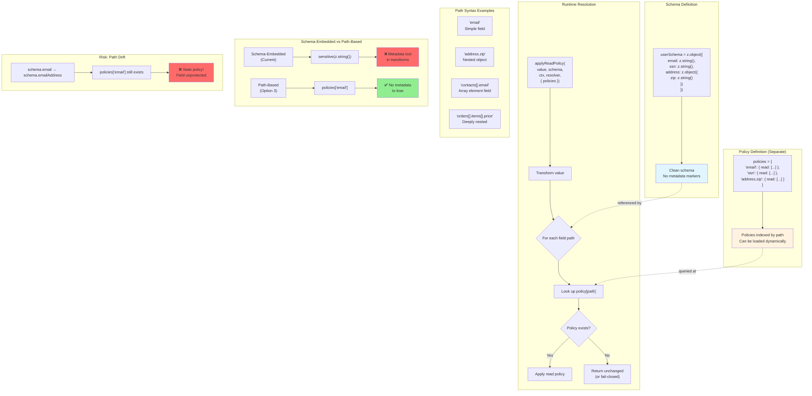

# Option 3: Path-Based Policies - External Policy Configuration

## Executive Summary

Instead of embedding sensitivity metadata IN schemas via `.meta()`, define policies **separately by field path**. This completely sidesteps the metadata-loss vulnerability since there's no metadata to lose.

---

## 1. Technical Approach

### 1.1 Current Problem (Schema-Embedded)

```typescript
const schema = z.object({
  email: sensitive(z.string(), {
    read: [{ status: 'full', requirements: 'admin' }]
  })
})

// Vulnerability: metadata lost through transforms
sensitive(z.string()).transform(fn)  // ❌ Metadata hidden
```

### 1.2 Path-Based Alternative

```typescript
// Schema is clean - no metadata markers
const userSchema = z.object({
  email: z.string(),
  ssn: z.string(),
  address: z.object({
    zip: z.string()
  })
})

// Policies defined separately, indexed by field path
const policies: PathPolicies = {
  'email': {
    read: [{ status: 'full', requirements: { role: 'admin' } }],
    write: { requirements: { role: 'admin' } }
  },
  'ssn': {
    read: [
      { status: 'full', requirements: { role: 'admin' } },
      { status: 'masked', requirements: { role: 'user' }, mask: v => '***-**-' + v.slice(-4) }
    ]
  },
  'address.zip': {
    read: [
      { status: 'full', requirements: { role: 'user' } },
      { status: 'masked', requirements: { role: 'guest' }, mask: v => v.slice(0, 3) + '**' }
    ]
  }
}
```

### 1.3 Array/Nested Path Syntax

```typescript
const policies: PathPolicies = {
  // Simple field
  'email': { ... },

  // Nested object
  'profile.address.street': { ... },

  // Array element field
  'contacts[].email': { ... },

  // Deeply nested array
  'orders[].items[].price': { ... },

  // Wildcard (all fields in object)
  'secrets.*': { ... }
}
```

### 1.4 Integration with Secure Wrappers

```typescript
// Current function signature
export async function applyReadPolicy<T, TCtx>(
  value: T,
  schema: z.ZodTypeAny,
  ctx: TCtx,
  resolver: EntitlementResolver,
  options?: ApplyReadPolicyOptions
): Promise<T>

// Modified for path-based policies
export async function applyReadPolicy<T, TCtx>(
  value: T,
  schema: z.ZodTypeAny,
  ctx: TCtx,
  resolver: EntitlementResolver,
  options: {
    policies: PathPolicies  // NEW: required policy map
    path?: string
    doc?: unknown
  }
): Promise<T> {
  return transformBySchemaAsync(value, schema, ctx, async (val, info) => {
    // Look up policy by field path instead of extracting from schema
    const policy = options.policies[info.path]
    if (!policy) return val  // No policy = not sensitive

    const decision = await resolveReadPolicy(
      { ctx, path: info.path, meta: { sensitive: true, read: policy.read }, operation: 'read' },
      policy.read ?? [],
      resolver
    )

    return transformToWire(val, decision)
  })
}
```

### 1.5 Type-Safe Path Configuration

```typescript
import type { z } from 'zod'

// Extract all possible paths from a schema (utility type)
type SchemaPaths<T extends z.ZodTypeAny> = /* complex mapped type */

// Type-safe policy configuration
function definePolicy<T extends z.ZodTypeAny>(
  schema: T,
  policies: Partial<Record<SchemaPaths<T>, FieldPolicy>>
): PathPolicies {
  return policies
}

// Usage - IDE autocomplete for paths!
const policies = definePolicy(userSchema, {
  'email': { read: [...] },        // ✅ Valid path
  'address.zip': { read: [...] },  // ✅ Valid path
  'invalid.path': { ... }          // ❌ TypeScript error
})
```

---

## 2. Analysis

### 2.1 DX (Developer Experience)

| Aspect | Assessment |
|--------|------------|
| **Separation of concerns** | ✅ Schema = shape, Policy = access control |
| **Single source of truth** | ⚠️ NO - schema and policies can drift |
| **IDE autocomplete** | ⚠️ Requires helper function for type safety |
| **Discoverability** | ⚠️ Must look in two places |
| **Refactoring** | ⚠️ Rename field = update policy paths manually |

**Key concern:** Schema changes don't automatically update policy paths.

```typescript
// Before refactor
const schema = z.object({ email: z.string() })
const policies = { 'email': { ... } }

// After refactor - EASY TO FORGET POLICY!
const schema = z.object({ emailAddress: z.string() })
const policies = { 'email': { ... } }  // ❌ Stale path!
```

### 2.2 Scalability

| Aspect | Assessment |
|--------|------------|
| **Many tables/fields** | ⚠️ Policy files can get large |
| **Policy composition** | ✅ Can merge policy objects |
| **Inheritance** | ✅ Can build policy hierarchies |
| **Dynamic policies** | ✅ Can load from DB/config |
| **Per-context policies** | ✅ Different policies per endpoint |

**Strength:** Policies can be dynamically loaded:
```typescript
const adminPolicies = await loadPolicies('admin')
const userPolicies = await loadPolicies('user')
```

### 2.3 Maintainability

| Aspect | Assessment |
|--------|------------|
| **Schema/policy sync** | ⚠️ HIGH RISK - paths can become stale |
| **Code review** | ⚠️ Changes require checking both files |
| **Testing** | ✅ Can test policies independently |
| **Documentation** | ✅ Policies are explicit and auditable |

**Mitigation:** Build-time validation:
```typescript
// In tests or build script
function validatePolicies(schema: z.ZodTypeAny, policies: PathPolicies) {
  const schemaPaths = extractAllPaths(schema)
  for (const path of Object.keys(policies)) {
    if (!schemaPaths.includes(path)) {
      throw new Error(`Policy path '${path}' not found in schema`)
    }
  }
}
```

### 2.4 Security

| Aspect | Assessment |
|--------|------------|
| **Transform immunity** | ✅ YES - no metadata to lose |
| **Fail-secure** | ⚠️ Depends on default behavior |
| **Forgotten fields** | ⚠️ New sensitive fields might lack policies |
| **Audit trail** | ✅ All policies in one place |

**Security consideration:** What if a field SHOULD be sensitive but has no policy?

```typescript
// Option A: Fail-open (dangerous default)
if (!policy) return val  // Returns raw value

// Option B: Fail-closed (safer)
if (!policy && isSensitiveValue(val)) {
  return { status: 'hidden', value: null }  // Auto-redact
}

// Option C: Explicit allowlist
if (!policy) {
  throw new Error(`No policy for path: ${info.path}`)
}
```

---

## 3. Comparison: Path-Based vs Schema-Embedded

| Aspect | Schema-Embedded | Path-Based |
|--------|-----------------|------------|
| **Transform-safe** | ❌ Metadata lost | ✅ No metadata to lose |
| **Single source of truth** | ✅ Policy with field | ❌ Separate files |
| **Refactor safety** | ✅ Moves with field | ❌ Manual path updates |
| **Dynamic policies** | ⚠️ Requires rebuild | ✅ Load at runtime |
| **Per-context** | ⚠️ Complex | ✅ Easy |
| **Discoverability** | ✅ Right next to field | ⚠️ Separate location |

### When Path-Based is Better
- Policies need to vary by context (admin vs user views)
- Policies are loaded from external config
- Same schema used in multiple systems
- Compliance requires policy audit trail

### When Schema-Embedded is Better
- Policies are static
- Single deployment context
- Tight coupling is acceptable
- Refactoring safety is priority

---

## 4. Hybrid Approach

Support both patterns:

```typescript
// Schema can have inline policies
const schema = z.object({
  email: sensitive(z.string(), { read: [...] }),  // Inline
  ssn: z.string()  // No inline policy
})

// Path-based policies can override or supplement
const policies = {
  'ssn': { read: [...] },  // External policy
  'email': { read: [...] } // Override inline policy
}

// Resolution order: path-based > inline > default
function resolveFieldPolicy(schema: z.ZodTypeAny, path: string, externalPolicies: PathPolicies) {
  // 1. Check external policies first
  if (externalPolicies[path]) return externalPolicies[path]

  // 2. Check inline metadata
  const inline = getSensitiveMetadata(schema)
  if (inline) return { read: inline.read, write: inline.write }

  // 3. Default
  return undefined
}
```

---

## 5. Pros/Cons Summary

### Pros
1. **Transform-immune** - No metadata to lose
2. **Dynamic loading** - Policies can come from DB/config
3. **Context flexibility** - Different policies per endpoint
4. **Audit-friendly** - All policies in one place
5. **Testable** - Test policies independently

### Cons
1. **Path maintenance** - Schema changes don't update paths
2. **Two sources** - Must check schema AND policies
3. **Type safety** - Requires helper functions
4. **Forgotten fields** - New sensitive fields might lack policies
5. **Refactoring risk** - Rename field = broken policy

---

## 6. Recommendation

**Best for:** Applications with dynamic/context-specific access control needs.

**Implementation effort:** Medium (2-3 days)

**Risk level:** Medium - path synchronization is ongoing concern

**Suggested mitigation:** Combine with build-time validation to catch stale paths.

---

## Appendix: Diagram


