# Option 4: Runtime Detection + Warning/Error

> **Status:** Required safety net (paired with Option 1)
>
> Decision: Default to **hard fail** (`throw`) when orphaned sensitive DB values are detected, with an escape hatch to configure alternate modes for non-PHI contexts.

## Executive Summary

Rather than fixing the traversal or changing the architecture, **detect and prevent** the problematic pattern. When `sensitive()` is used in a way that would hide metadata, warn developers or fail securely.

This is a **defensive approach** that catches mistakes rather than making them impossible.

---

## 1. Technical Approaches

### 1.1 Proxy-Based Detection

Wrap the return value from `sensitive()` in a Proxy that detects dangerous method calls.

```typescript
export function sensitive<T extends z.ZodTypeAny>(inner: T, options?: SensitiveOptions): T {
  const meta: SensitiveMetadata = { sensitive: true, ...options }
  const marked = inner.meta({ [SENSITIVE_META_KEY]: meta })

  return new Proxy(marked, {
    get(target, prop) {
      if (prop === 'transform' || prop === 'refine' || prop === 'pipe') {
        console.warn(
          `⚠️ SECURITY WARNING: Calling .${String(prop)}() on sensitive() schema ` +
          `will hide metadata! Consider using z.string().${String(prop)}(...).pipe(sensitive(...)) instead.`
        )
      }
      return target[prop]
    }
  }) as T
}
```

**Pros:**
- Immediate feedback during development
- No runtime overhead in production (remove in build)
- Clear warning message

**Cons:**
- Proxies can break `instanceof` and equality checks
- Zod internals might not work with Proxies
- Developers can ignore warnings
- TypeScript types don't reflect the Proxy

### 1.2 Static Analysis (ESLint Rule)

Create an ESLint rule that flags the pattern at lint time.

```typescript
// eslint-plugin-zodvex/no-transform-after-sensitive.ts
module.exports = {
  meta: {
    type: 'problem',
    docs: { description: 'Disallow .transform()/.refine() after sensitive()' },
    fixable: 'code',
    schema: []
  },
  create(context) {
    return {
      CallExpression(node) {
        const methodName = node.callee.property?.name
        if (methodName === 'transform' || methodName === 'refine' || methodName === 'pipe') {
          // Check if callee is sensitive(...)
          const callee = node.callee.object
          if (callee?.type === 'CallExpression' &&
              callee.callee?.name === 'sensitive') {
            context.report({
              node,
              message: `Metadata is lost when .${methodName}() wraps sensitive(). ` +
                       `Use sensitive(schema.${methodName}(...)) instead.`
            })
          }
        }
      }
    }
  }
}
```

**Pros:**
- Catches at build time
- No runtime overhead
- Can provide auto-fix
- Integrates with CI

**Cons:**
- Only catches direct patterns (not variables)
- Requires users to adopt ESLint rule
- Fragile to AST changes
- Can't catch all edge cases

### 1.3 Runtime Validation in applyReadPolicy()

Detect when the DB contains sensitive-looking data but the schema has no marker.

```typescript
export async function applyReadPolicy<T, TCtx>(
  value: T,
  schema: z.ZodTypeAny,
  ctx: TCtx,
  resolver: EntitlementResolver,
  options?: ApplyReadPolicyOptions
): Promise<T> {
  // Pre-scan: detect orphaned sensitive values
  const orphans = detectOrphanedSensitiveValues(value, schema)
  if (orphans.length > 0) {
    // Option A: Warn
    console.warn(`⚠️ Found ${orphans.length} sensitive values without schema markers:`, orphans)

    // Option B: Auto-redact (fail-secure)
    return redactOrphanedFields(value, orphans)

    // Option C: Throw
    throw new Error(`Potential security issue: sensitive values at ${orphans.join(', ')} lack policies`)
  }

  return transformBySchemaAsync(/* normal processing */)
}

function detectOrphanedSensitiveValues(value: unknown, schema: z.ZodTypeAny): string[] {
  const orphans: string[] = []

  // Walk value looking for __sensitiveValue wrappers
  // Compare against findSensitiveFields(schema)
  // Any __sensitiveValue not in schema's sensitive fields = orphan

  walkValue(value, (val, path) => {
    if (isSensitiveDbValue(val)) {
      const schemaMeta = getMetadataAtPath(schema, path)
      if (!schemaMeta?.sensitive) {
        orphans.push(path)
      }
    }
  })

  return orphans
}
```

**Pros:**
- Catches ALL forms of the vulnerability
- Fail-secure by default
- No developer adoption needed
- Works at runtime when data is accessed

**Cons:**
- Performance overhead (extra traversal)
- Detection is "late" (data already queried)
- Must distinguish intentional from accidental hiding
- Complex implementation

### 1.4 Brand/Symbol Marking

Add a non-metadata marker that survives transforms.

```typescript
// Create a unique symbol
const SENSITIVE_BRAND = Symbol('zodvex:sensitive')

// Store in a WeakMap keyed by schema instance
const sensitiveSchemas = new WeakMap<z.ZodTypeAny, SensitiveMetadata>()

export function sensitive<T extends z.ZodTypeAny>(inner: T, options?: SensitiveOptions): T {
  const marked = inner.meta({ [SENSITIVE_META_KEY]: options })

  // ALSO store in WeakMap - survives transforms!
  sensitiveSchemas.set(marked, { sensitive: true, ...options })

  return marked
}

// Modified detection - check WeakMap first
export function getSensitiveMetadata(schema: z.ZodTypeAny): SensitiveMetadata | undefined {
  // Check WeakMap (survives transforms)
  if (sensitiveSchemas.has(schema)) {
    return sensitiveSchemas.get(schema)
  }

  // Fall back to metadata check
  return getMetadataFromMeta(schema)
}
```

**Problem:** WeakMap is keyed by object identity. When you call `.transform()`, you get a NEW schema object - the original is still in the WeakMap but the new one isn't.

**Alternative: Store on prototype chain:**
```typescript
// Monkey-patch the schema instance
export function sensitive<T extends z.ZodTypeAny>(inner: T, options?: SensitiveOptions): T {
  const marked = inner.meta({ [SENSITIVE_META_KEY]: options })
  ;(marked as any)[SENSITIVE_BRAND] = { sensitive: true, ...options }
  return marked
}

// Detection checks for brand
function isSensitive(schema: z.ZodTypeAny): boolean {
  // Check schema and all _def.schema ancestors
  let current: any = schema
  while (current) {
    if (current[SENSITIVE_BRAND]) return true
    current = current._def?.schema ?? current._def?.in ?? current._def?.innerType
  }
  return false
}
```

**Pros:**
- Brand survives as long as we walk the chain
- No external state (WeakMap)
- Works with existing traversal

**Cons:**
- Still requires traversal (like Option 1)
- Monkey-patching is fragile
- Zod could clear custom properties

---

## 2. Fail-Secure Strategies

### 2.1 Default Behavior Options

| Strategy | Behavior | Safety | DX |
|----------|----------|--------|-----|
| **Fail-open** | Return raw value | ❌ Dangerous | ✅ Easy |
| **Fail-closed** | Auto-redact | ✅ Safe | ⚠️ Surprising |
| **Fail-loud** | Throw error | ✅ Safe | ⚠️ Disruptive |
| **Warn + open** | Log warning, return raw | ⚠️ Moderate | ✅ Easy |
| **Warn + closed** | Log warning, redact | ✅ Safe | ⚠️ Surprising |

### 2.2 Recommended: Configurable Fail-Secure

```typescript
type FailSecureMode = 'open' | 'closed' | 'throw' | 'warn'

export function applyReadPolicy<T>(..., options?: {
  failSecure?: FailSecureMode  // Default: 'closed'
}) {
  const mode = options?.failSecure ?? 'closed'

  if (orphanedSensitiveFields.length > 0) {
    switch (mode) {
      case 'open':
        return value  // Dangerous but explicit
      case 'closed':
        return redactFields(value, orphanedSensitiveFields)
      case 'throw':
        throw new Error('Unhandled sensitive fields detected')
      case 'warn':
        console.warn('Unhandled sensitive fields:', orphanedSensitiveFields)
        return value
    }
  }
}
```

---

## 3. Analysis

### 3.1 DX (Developer Experience)

| Aspect | Assessment |
|--------|------------|
| **Error clarity** | ⚠️ "Metadata lost" is confusing |
| **Discoverability** | ⚠️ Only found when issue occurs |
| **Learning curve** | ⚠️ Must understand Zod internals |
| **IDE support** | ❌ No autocomplete for correct pattern |

**Better error messages:**
```typescript
throw new Error(
  `Security Error: Field '${path}' contains sensitive data but has no access policy.\n` +
  `This usually happens when .transform() or .refine() is called after sensitive().\n\n` +
  `Fix: Change sensitive(z.string()).transform(fn) to sensitive(z.string().transform(fn))\n` +
  `Or use path-based policies to define access control.`
)
```

### 3.2 Scalability

| Aspect | Assessment |
|--------|------------|
| **Performance** | ⚠️ Runtime detection adds overhead |
| **False positives** | ⚠️ Legitimate transforms flagged |
| **False negatives** | ⚠️ Proxy approach can miss some cases |
| **Build time** | ✅ ESLint rule adds no runtime cost |

### 3.3 Maintainability

| Aspect | Assessment |
|--------|------------|
| **Proxy fragility** | ⚠️ HIGH - Zod might not work with Proxies |
| **ESLint stability** | ⚠️ MEDIUM - AST patterns can change |
| **Runtime check** | ✅ LOW - just data comparison |
| **Symbol approach** | ⚠️ MEDIUM - depends on Zod internals |

### 3.4 Security

| Aspect | Assessment |
|--------|------------|
| **Fail-secure** | ✅ Can achieve with closed default |
| **Detection coverage** | ⚠️ Varies by approach |
| **Bypass risk** | ⚠️ Determined developers can bypass |
| **Defense in depth** | ✅ Catches what other options miss |

---

## 4. Pros/Cons Summary

### Pros
1. **Catches mistakes** - Helps developers find the problem
2. **Fail-secure option** - Can auto-redact unknown sensitive data
3. **Layered defense** - Works alongside other options
4. **No API changes** - Existing code continues to work
5. **Configurable** - Choose behavior per use case

### Cons
1. **Not preventive** - Detects after the fact, not before
2. **Performance overhead** - Runtime checks cost cycles
3. **Fragile implementations** - Proxy/ESLint can break
4. **DX friction** - Errors can be confusing
5. **False positives** - May flag legitimate patterns

---

## 5. Recommendation

**Best for:** Defense-in-depth alongside another option.

**Should NOT be the only solution** - detection is reactive, not preventive.

**Best combination:**
- Option 1 (Traversal) or Option 2 (Wrapper) as primary fix
- Option 4 (Runtime Detection) as safety net
- ESLint rule for early warning

**Implementation effort:** Low-Medium (1-2 days for runtime check)

**Risk level:** Low - additive safety layer

---

## Appendix: Diagram

```mermaid
%% Option 4: Runtime Detection + Fail-Secure
%% Shows detection flow and fail-secure behavior

graph TD
    subgraph "Detection Approaches"
        A1["Proxy-Based<br/>Wrap sensitive() return"]
        A1 --> A1a["Intercept .transform() calls"]
        A1a --> A1b["⚠️ Console warning"]

        A2["ESLint Rule<br/>Static analysis"]
        A2 --> A2a["Detect AST pattern:<br/>sensitive(...).transform(...)"]
        A2a --> A2b["❌ Lint error at build"]

        A3["Runtime Validation<br/>In applyReadPolicy()"]
        A3 --> A3a["Scan value for<br/>__sensitiveValue"]
        A3a --> A3b["Compare to schema<br/>sensitive fields"]
        A3b --> A3c{"Orphaned<br/>values?"}

        A4["Symbol/Brand<br/>Non-metadata marker"]
        A4 --> A4a["Store brand on schema"]
        A4a --> A4b["Walk _def chain<br/>to find brand"]
    end

    subgraph "Fail-Secure Modes"
        F1{"Orphaned sensitive<br/>fields detected"}
        F1 -->|"mode: 'open'"| F2["Return raw value<br/>❌ Dangerous"]
        F1 -->|"mode: 'closed'"| F3["Auto-redact<br/>✅ Safe"]
        F1 -->|"mode: 'throw'"| F4["Throw error<br/>✅ Safe but disruptive"]
        F1 -->|"mode: 'warn'"| F5["Log + return raw<br/>⚠️ Moderate"]
    end

    subgraph "Detection Flow: applyReadPolicy()"
        D1["Value from DB"]
        D1 --> D2["Find __sensitiveValue<br/>wrappers in data"]
        D2 --> D3["Find sensitive fields<br/>in schema"]
        D3 --> D4{"All __sensitiveValue<br/>have matching<br/>schema markers?"}
        D4 -->|"Yes"| D5["✅ Process normally"]
        D4 -->|"No"| D6["⚠️ Orphaned fields<br/>detected!"]
        D6 --> F1
    end

    subgraph "Example: The Vulnerability"
        E1["sensitive(z.string())<br/>.transform(fn)"]
        E1 --> E2["Schema: ZodTransform<br/>(no sensitive marker visible)"]
        E2 --> E3["DB value: { __sensitiveValue: 'secret' }"]
        E3 --> E4["Detection compares:<br/>- Data has __sensitiveValue ✓<br/>- Schema has no marker ✗"]
        E4 --> E5["🚨 ORPHAN DETECTED"]
    end

    A3c -->|"Yes"| F1
    A3c -->|"No"| D5

    style F2 fill:#ff6b6b
    style F3 fill:#90ee90
    style F4 fill:#ffd700
    style F5 fill:#fff3e0
    style E5 fill:#ff6b6b
    style D5 fill:#90ee90
```


